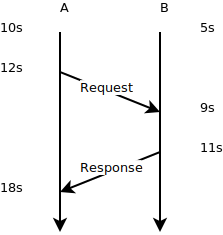
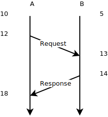

Coming from an operations background, I've found that one of the best ways to understand a system's behaviour is to trace the messages between components. Now, most languages go have a log library, that will at minimum, allow developers to log when an event occurred with a description.

However, if we want to collate log events from different machines, say, one service calling out to another, then clock drift can make it appear that the request was processed by the receiver before the caller requested it, as in the following diageram:

------- ------- ---------------
Process Time    Event
A       12s     Send Request
B       9s      Receive Request
B       11s     Send Response
A       18s     Receive Response
---     ---     ---

Judging from the timestamps, it appears that the message was processed by B before it was sent by A.

A common solution to this is to use a logical timestamp usually known as a Lamport Clock. In this scheme, a node keeps track of the timestamps from messages it had received, and ensures that it emits timestamps that are greater (IE after) any previously observed timestamp.

We can see at this point, that the clock at process B is forced to catch up when it receives the message from A.

With the extra information, we can now put our log into a coherent causal order:

------- ------- ---------------
Process Time    Event
A       12      Send Request
B       13      Receive Request
B       14      Send Response
A       18      Receive Response
---     ---     ---

However, although the trace is now rather more coherently ordered, the fact that the timestamps are out of order makes things look rather... odd. It can also add a significant burden when tracing events through a system when debugging an issue.

So, we can have our cake and eat it by, basically using both techniques, defining our timestamps as a tuple of (wall time, counter). 

We can avoid problems caused by clocks running slow, and hence causing the observed time to jump backwards by keeping a record of the most greatest observed timestamp, including the logical counter. Then, when we want to timestamp an event, we take the greater of the observed timestamp, and the local clock.

So, in the easy case where all clocks are correctly synchronised, then we can just take the value of the local clock, note that it is greater than anything we have seen before, and, output that with a counter of zero. However, if the local clock is behind, then we output the recorded timestamp with the counter incremented by one, as shown in the above diagram. 

The only downside is that the wall-clock portion of a hybrid-clock may seem to behave like a ratchet, being static for a time, and then jumping when a message is received.

The technique is described in [Hybrid Logical Clocks](http://muratbuffalo.blogspot.co.uk/2014/07/hybrid-logical-clocks.html), and the accompanying paper [Logical Physical Clocks and Consistent Snapshots in Globally Distributed Databases](https://www.cse.buffalo.edu/tech-reports/2014-04.pdf)

It's worth noting that whilst this provides a partial order over all events, it can't be used to tell if two events happened concurrently. Happily, [vector clocks and friends](http://m.cacm.acm.org/magazines/2016/4/200168-why-logical-clocks-are-easy/abstract) are widely applied for this purpose.

One insight that this paper catalysed is that a system only knows of the progress of time by taking discrete samples of a time source, either a quartz crystal inside a laptop or a remote time server. So there is nothing special about the local clock source, beyond performance. 

This is especially useful considering that larger machines today look a lot more like networks inside than a single monolithic bus. In fact, recent Intel CPUs have their own local clock (time stamp counter), so in a multi-processor system, there can be divergent notions of the current time. Because of this, the operating system will usually provide an interface that preserves precision, whilst compensating for things like a process being migrated to another processor that may have been previously put to sleep, and whose clock may be behind.

I've implemented this algorithm in rust, and it can be found on crates.io as [hybrid-clocks](https://crates.io/crates/hybrid-clocks).
